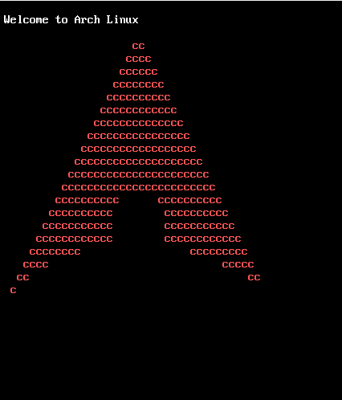

# **ArchLinux**

#### **Automated installation of Linux Arch**

### **_ArchLinux_**

## **Arch Linux installation**

#### **_Installation folder_**
> mount your pendrive in /mnt

> copy the ArchLinux folder to /

> dismount the pendrive

> cd /ArchLinux

> source setup.sh

#### **_After finishing_**
> move the ArchLinux folder to /mnt

> use the command arch-chroot /mnt to start a new system

> cd /ArchLinux

> source setup2.sh

#### **_After finishing_**

#### **_create a password for root_**
> passwd 

#### **_If you want to create a user_**
> useradd -m sorry

> passwd sorry

#### **_returning the installation_**

> restart your computer

> cd /ArchLinux

> source setup3.sh

> after you finish, delete the ArchLinux folder

#### **_Export the language_**
> export LANG=pt_BR.UTF-8

#### **_Set standard keyboard_**
> localectl set-x11-keymap br abnt2

#### **_Restart your computer_**

#### **_If useradd -m is not creating the files for home_**
> xdg-user-dirs-update

## License
Distributed under the terms of the GNU General Public License, version 3. See the [`LICENSE`](LICENSE) file for details.
